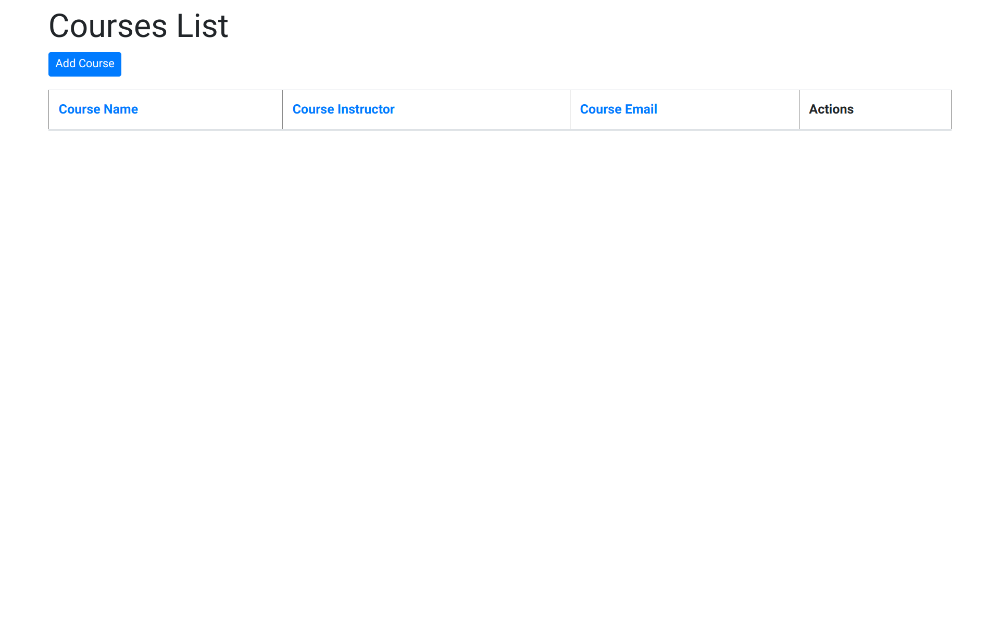
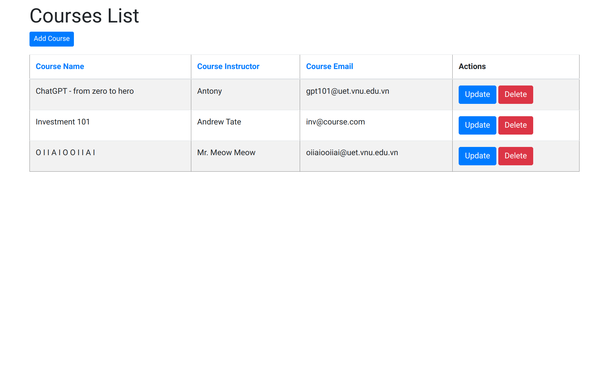
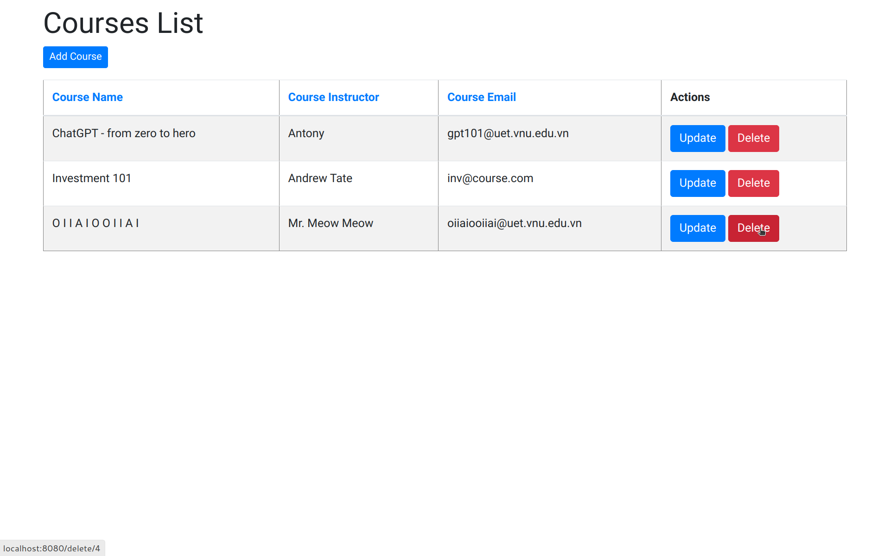
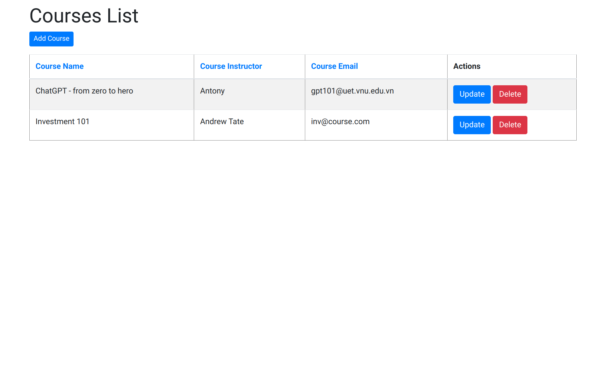

## Homework Part 2: Spring Boot - Spring MVC CRUD with Example
### Demo
#### Homepage

#### Add course

##### Homepage after courses are added

#### Update course info

##### Homepage after course is updated

#### Delete a course

##### Homepage after course is deleted

